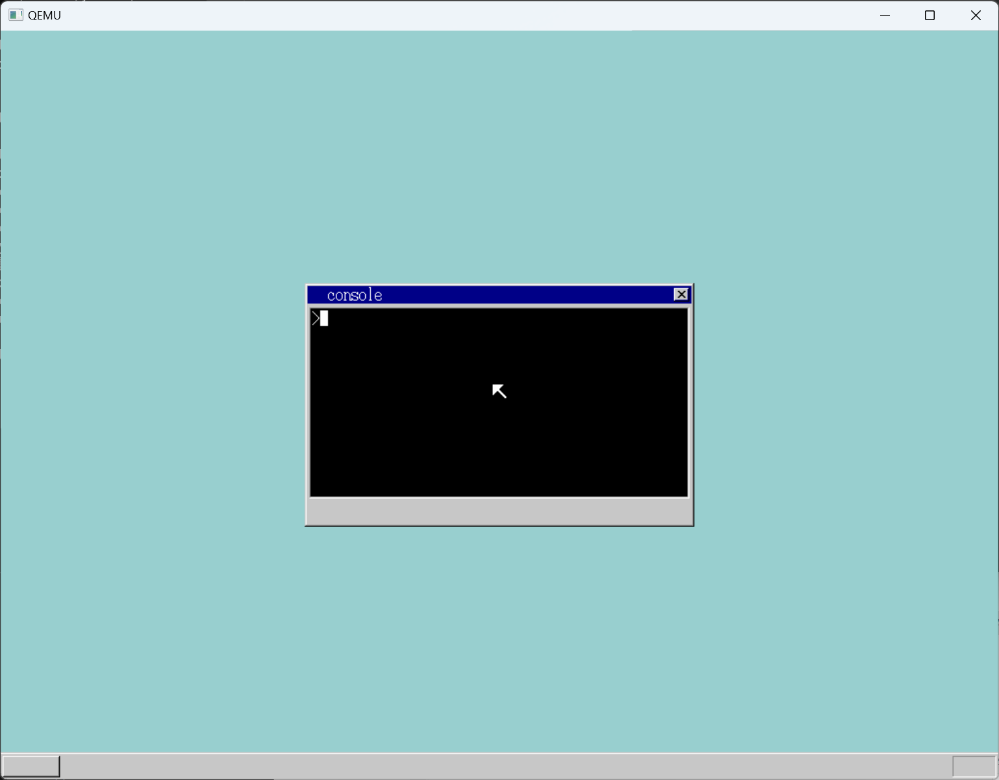
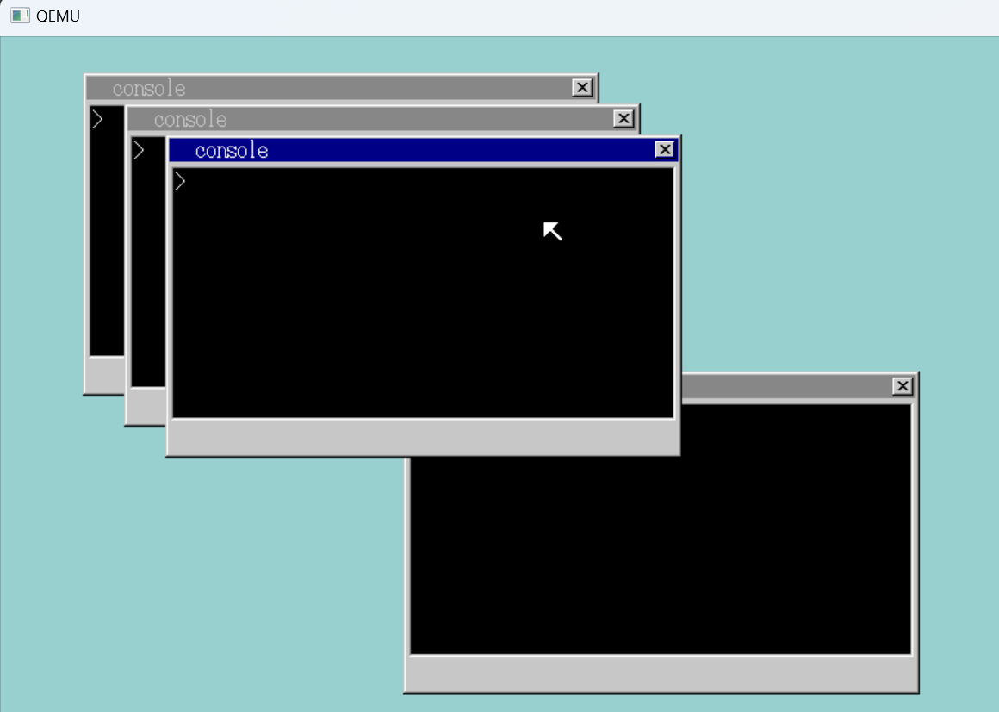
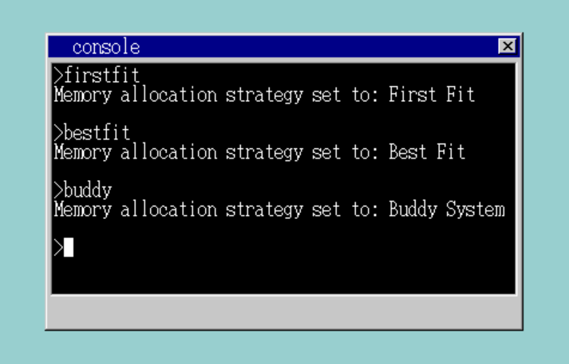
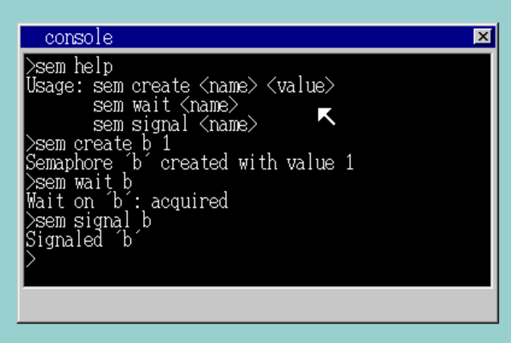
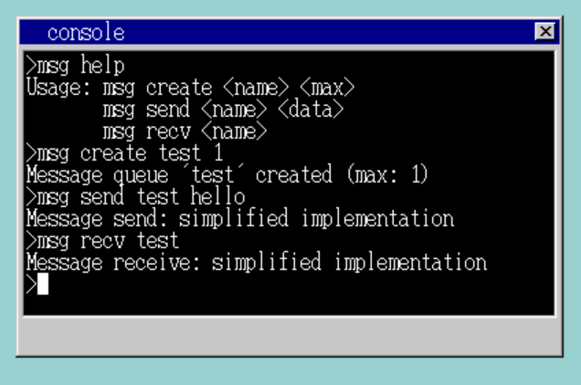
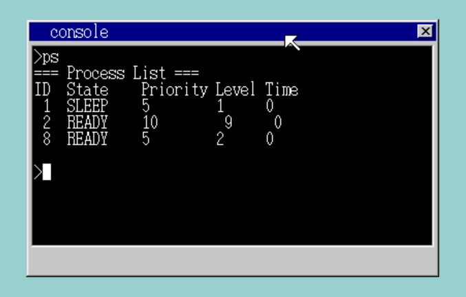

# LydiaOS

LydiaOS 是一个面向学习和实验的图形操作系统，支持多窗口、多任务、内存管理、文件系统和丰富的应用程序接口。用户可通过命令行和窗口系统体验基本的 OS 功能。

## 系统主要功能
- 多窗口图形界面，支持鼠标和键盘操作
- 多任务调度与窗口切换
- 内存管理（支持多种分配策略、虚拟内存、页表、引用计数、内存池等）
- 文件系统与文件操作
- 进程间通信（信号量、消息队列、统一IPC管理）
- 丰富的 API，便于开发自定义应用
- 支持多种内置应用程序
- 设备驱动与高效中断处理

## 启动与运行
1. 在 `LydiaOS` 目录下，构建并运行系统：
   ```bash
   make run
   ```
2. QEMU 启动后，系统会自动弹出一个控制台窗口（console），可用命令行进行操作。
<div align="center">
  
</div>

---

## 1. 内存管理系统
LydiaOS 支持多种内存分配与管理策略，支持虚拟内存、页表、引用计数和内存池。

### 支持的内存分配策略
- **First Fit（首次适配）**
- **Best Fit（最佳适配）**
- **Buddy System（伙伴系统）**

### 相关命令行指令
| 命令         | 功能说明                                 | 示例                |
|--------------|------------------------------------------|---------------------|
| mem          | 查看当前内存使用情况                     | mem                 |
| memtest      | 进行内存测试，显示可用物理内存           | memtest             |

---

## 2. 任务调度系统
LydiaOS 采用多级反馈队列调度，支持动态优先级调整和多种任务状态。

### 相关命令行指令
| 命令         | 功能说明                                 | 示例                |
|--------------|------------------------------------------|---------------------|
| ps           | 查看所有进程/任务状态                    | ps                  |
| sched        | 查看调度队列和优先级信息                 | sched               |

### 任务状态
- 未使用、就绪、运行、阻塞、睡眠、等待、僵尸（共7种）
- 支持周期性优先级恢复，防止饥饿
- 支持抢占式调度

---

## 3. 进程间通信（IPC）
LydiaOS 支持信号量、消息队列等多种 IPC 机制。

### 相关命令行指令
| 命令         | 功能说明                                 | 示例                |
|--------------|------------------------------------------|---------------------|
| ipc          | 查看所有 IPC 资源状态                    | ipc                 |
| sem          | 信号量操作（查看/创建/删除/P/V）         | sem                 |
| msg          | 消息队列操作（查看/发送/接收）           | msg                 |

> **说明：**
> - `sem`、`msg` 命令支持参数，可通过 `sem help`、`msg help` 查看详细用法。
> - 常用参数示例：
>   - `sem list`：列出所有信号量
>   - `sem create 名称`：创建信号量
>   - `sem delete 名称`：删除信号量
>   - `sem p 名称`：P（等待）操作
>   - `sem v 名称`：V（释放）操作
>   - `msg list`：列出所有消息队列
>   - `msg send 队列名 内容`：发送消息
>   - `msg recv 队列名`：接收消息
>   - 具体参数和格式请以 `sem help`、`msg help` 输出为准。

---

## 4. 控制台系统
LydiaOS 控制台支持丰富的命令和参数解析。

### 基本命令
| 命令      | 功能说明           | 示例             |
|-----------|--------------------|------------------|
| mem       | 查看内存信息       | mem              |
| cls       | 清屏               | cls              |
| dir       | 列出当前目录文件   | dir              |
| type      | 显示文件内容       | type make.bat    |
| typeipl   | 显示 IPL 文件内容  | typeipl          |
| exit      | 关闭当前控制台窗口 | exit             |

### 功能测试命令
| 命令      | 功能说明           | 示例             |
|-----------|--------------------|------------------|
| ps        | 查看进程/任务状态  | ps               |
| sched     | 查看调度信息       | sched            |
| priority  | 查看优先级信息     | priority help    |
| ipc       | 查看 IPC 状态      | ipc              |
| memtest   | 物理内存测试       | memtest          |
| sem       | 信号量操作         | sem help         |
| msg       | 消息队列操作       | msg help         |

### 内存分配策略切换
| 命令      | 功能说明           | 示例             |
|-----------|--------------------|------------------|
| firstfit  | 首次适配分配算法   | firstfit         |
| bestfit   | 最佳适配分配算法   | bestfit          |
| buddy     | 伙伴系统分配算法   | buddy            |

### IPC 相关命令参数示例
- `sem create <name> <value>`：创建信号量
- `sem wait <name>`：P操作
- `sem signal <name>`：V操作
- `msg create <name> <max>`：创建消息队列
- `msg send <name> <data>`：发送消息
- `msg recv <name>`：接收消息

## 操作流程演示

1. 启动系统后，进入多窗口界面，可用鼠标切换窗口、移动窗口。
2. 在任意控制台窗口输入上述命令体验系统功能。
3. 可通过 `firstfit`、`bestfit`、`buddy` 命令切换内存分配算法，实时观察内存分配效果。
4. 使用 `sem`、`msg` 命令体验进程间通信。
5. 输入应用名称（如 `a`、`hello3` 等）可加载并运行窗口应用。

## 系统运行截图

多窗口与多任务：


内存管理切换：


进程间通信演示：



应用加载演示：


系统信息与测试：


## 参考
- 详细设计与实现请见 [LydiaOS_项目说明文档.md](./Report/LydiaOS_项目说明文档.md)
- 相关源码与构建脚本见各目录

