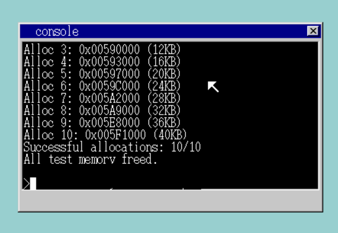
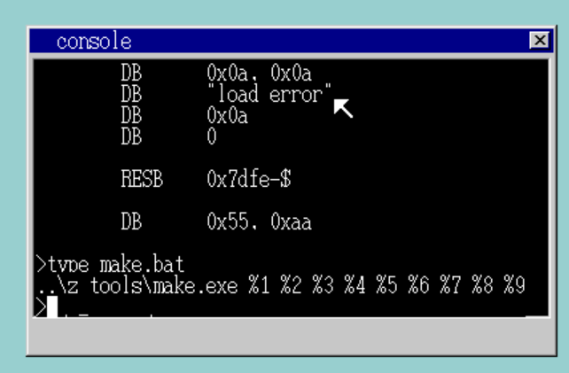
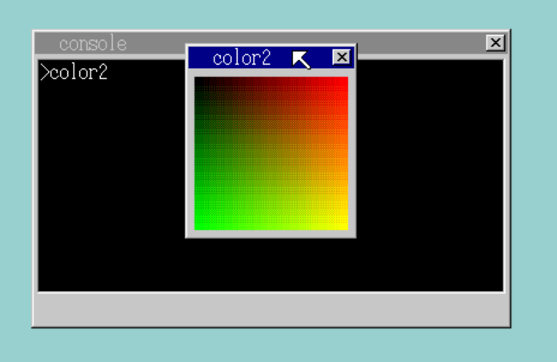

# LydiaOS 项目说明文档

项目仓库地址（GitHub）：https://github.com/Lydia-1204/LydiaOS

## 目录

1. [引言](#1-引言)
    - [项目背景](#11-项目背景)
    - [项目简介](#12-项目简介)
    - [基本概念](#13-基本概念)
    - [文档结构](#14-文档结构)
2. [开发环境](#2-开发环境)
    - [开发环境概述](#21-开发环境概述)
    - [开发环境搭建](#22-开发环境搭建)
    - [项目配置](#23-项目配置)
    - [运行项目](#24-运行项目)
3. [系统设计](#3-系统设计)
    - [系统架构概述](#31-系统架构概述)
    - [系统设计原则](#32-系统设计原则)
    - [系统架构设计](#33-系统架构设计)
    - [系统技术选型](#34-系统技术选型)
    - [项目结构设计](#35-项目结构设计)
4. [引导程序实现](#4-引导程序实现)
    - [引导过程概述](#41-引导过程概述)
    - [引导程序实现](#42-引导程序实现)
5. [核心功能实现](#5-核心功能实现)
    - [多任务调度](#51-多任务调度)
    - [内存管理](#52-内存管理)
    - [窗口与图层系统](#53-窗口与图层系统)
    - [控制台与命令行](#54-控制台与命令行)
    - [进程间通信（IPC）](#55-进程间通信ipc)
    - [文件系统支持](#56-文件系统支持)
    - [系统调用与 API](#57-系统调用与-api)
    - [中断与定时器](#58-中断与定时器)
    - [应用加载与运行](#59-应用加载与运行)
    - [其他功能](#510-其他功能)
6. [标准运行库实现](#6-标准运行库实现)
    - [标准运行库概述](#61-标准运行库概述)
    - [窗口管理](#62-功能-1窗口管理)
    - [内存管理](#63-功能-2内存管理)
    - [输入输出](#64-功能-3输入输出)
    - [定时器](#65-功能-4定时器)
    - [文件操作](#66-功能-5文件操作)
    - [系统信息](#67-功能-6系统信息)
7. [应用程序实现](#7-应用程序实现)
    - [应用程序构建脚本](#71-应用程序构建脚本)
    - [应用程序链接器脚本](#72-应用程序链接器脚本)
    - [应用程序入口](#73-应用程序入口)
    - [应用程序实现](#74-应用程序实现)
8. [系统演示](#8-系统演示)
    - [功能演示 1：多窗口与多任务](#81-功能演示-1多窗口与多任务)
    - [功能演示 2：内存管理切换](#82-功能演示-2内存管理切换)
    - [功能演示 3：进程间通信](#83-功能演示-3进程间通信)
    - [功能演示 4：应用加载](#84-功能演示-4应用加载)
    - [功能演示 5：系统信息与测试](#85-功能演示-5系统信息与测试)
9. [总结与展望](#9-总结与展望)
    - [项目总结](#91-项目总结)
    - [项目挑战](#92-项目挑战)

<div style="page-break-after: always;"></div>

## 1 引言


### 1.1 项目背景
随着计算机体系结构和操作系统理论的不断发展，传统的理论学习已难以满足深入理解系统底层机制的需求。LydiaOS 以 x86 架构为基础，采用软盘镜像的方式运行，旨在搭建一个可操作、可实验、可扩展的操作系统平台。通过理解原理、编写程序、运行和修改系统，能直观地掌握引导加载、内核初始化、内存管理、多任务调度、窗口系统、应用接口等核心原理，提升对操作系统整体架构和实现细节的理解。


### 1.2 项目简介
LydiaOS 是一个基于操作系统理论知识的简易操作系统，具备如下主要特性：
- **多任务调度**：支持多个任务并发运行。
- **窗口管理**：自绘窗口系统，支持多窗口操作。
- **内存分配**：实现多种分配算法，便于对比。
- **进程间通信（IPC）**：支持信号量、消息队列等机制。
- **应用接口**：标准库为应用程序提供统一的系统调用接口。
- **分层设计**：将**内核**、**标准库**和**应用程序**明确分离，便于模块化开发和功能扩展。


### 1.3 基本概念
LydiaOS 的核心由以下几个部分组成：
- **引导程序**：系统启动时首先执行的代码，负责将内核从磁盘加载到内存，并完成必要的硬件初始化，为内核的运行做好准备。
- **内核**：操作系统的核心部分，负责管理硬件资源，实现任务调度、内存管理、窗口与控制台、系统调用等功能，是系统稳定运行的基础。
- **标准库**：为应用程序提供一组系统调用接口，屏蔽底层实现细节，使应用开发更加便捷和安全。
- **应用程序**：运行在操作系统之上的用户程序，利用标准库提供的接口与内核交互，实现各种功能和用户交互。
- **IPC**：进程间通信机制，包括信号量、消息队列等，用于实现任务之间的数据交换和同步。


### 1.4 文档结构
本说明文档将按照操作系统开发的实际流程和模块划分，依次介绍：
- **开发环境** 的搭建与配置
- **系统设计** 思路
- **引导程序** 的实现细节
- **内核与核心功能模块** 的实现
- **标准运行库** 的接口实现
- **应用程序** 的开发与构建
- **系统功能演示**
- **项目总结与展望**

---

## 2 开发环境


### 2.1 开发环境概述
- LydiaOS 的开发环境以 Windows 系统为基础，沿用《30天自制操作系统》的工具链，包括 make、nask、cc1、obj2bim、bim2hrb 等工具，能够完成从汇编、C 语言编译到二进制镜像生成的全流程。
- 系统运行和调试主要依赖 QEMU 虚拟机，能够方便地在现代 PC 上模拟软盘启动和操作系统运行环境。所有工具均已集成在 `z_tools` 目录下，无需额外安装，极大降低了环境配置难度。


### 2.2 开发环境搭建
开发者只需在 Windows 系统下解压项目文件，确保 `z_tools` 目录完整即可。所有编译、链接、镜像生成工具均已包含在该目录，无需手动安装。QEMU 虚拟机同样集成在工具链中，支持一键启动和调试操作系统镜像。


### 2.3 项目配置
项目的主要源码集中在 `lydia/` 目录下，包含内核、驱动、标准库等核心模块。Makefile 文件通过 `TOOLPATH` 变量指定工具链路径，确保编译流程的自动化和一致性。各类应用程序源码分布在 `a/`、`hello3/`、`hello4/` 等子目录，便于分类管理和独立编译。通过合理的目录结构和配置，项目支持多模块并行开发和独立测试。


### 2.4 运行项目
在 `LydiaOS` 目录下直接运行 `make.bat` 或使用 `make lydia.img` 命令生成系统软盘镜像文件 `lydia.img`。构建完成后，通过 `make run` 或 `run` 目标即可自动调用 QEMU 虚拟机加载并启动该镜像，实现对操作系统的完整仿真和交互，便于快速迭代和调试。


<div align="center">

</div>

---

## 3 系统设计


### 3.1 系统架构概述
LydiaOS 采用宏内核架构，主要组件包括：


| 层级         | 主要内容                                                                 |
|--------------|--------------------------------------------------------------------------|
| 应用程序层   | 应用程序                                                                  |
| 系统调用接口 | 提供应用与内核交互的 API                                                 |
| 内核层       | <ul><li>任务管理器</li><li>内存管理器</li><li>文件系统</li><li>设备驱动</li><li>图形系统</li><li>中断处理</li></ul> |
| 硬件抽象层   | 屏蔽底层硬件细节，向上提供统一接口                                        |


### 3.2 系统设计原则
LydiaOS 在设计时坚持以下原则：
- **模块化**：各功能模块（如**内核**、**驱动**、**应用**）相互独立，接口清晰，便于后续功能扩展和维护。
- **简洁性**：核心功能实现力求简明，注重对基础知识的应用，避免过度复杂化。
- **可扩展性**：系统支持多种内存分配和调度算法，方便进行对比和原理理解。


### 3.3 系统架构设计
系统整体架构分为引导程序、内核、标准库和应用层。
- **引导程序**负责系统启动时的硬件初始化和内核加载，并切换到保护模式。
- **内核**作为系统的核心，管理所有硬件资源，实现任务调度、内存管理、窗口系统、进程间通信和系统调用等功能。
- **标准库**为应用程序提供统一的 API，屏蔽底层实现细节，简化应用开发。
- **应用层**则通过标准库接口与内核交互，实现各种用户功能和交互界面。

其中，内核主循环的部分代码如下（摘自 `bootpack.c`）：

```c
void HariMain(void)
{
    // ...系统初始化...
    for (;;) {
        if (fifo32_status(&keycmd) > 0 && keycmd_wait < 0) {
            keycmd_wait = fifo32_get(&keycmd);
            wait_KBC_sendready();
            io_out8(PORT_KEYDAT, keycmd_wait);
        }
        io_cli();
        if (fifo32_status(&fifo) == 0) {
            // ...任务调度与休眠...
        } else {
            i = fifo32_get(&fifo);
            io_sti();
            // ...事件处理...
        }
    }
}
```


### 3.4 系统技术选型
主要技术选型如下：
- **汇编与 C 语言混合开发**：既保证了底层硬件操作的高效性，又兼顾了上层逻辑的可读性和可维护性。
- **多任务调度**：采用多级优先级队列，支持任务切换、休眠和唤醒。
- **内存管理**：实现了首次适配、最佳适配和伙伴系统等多种分配算法，便于原理理解和性能对比。
- **窗口与控制台系统**：基于自绘图层，支持多窗口并发、窗口移动和焦点切换，提升了系统的交互性和可视化效果。


### 3.5 项目结构设计

项目结构如下：
- `lydia/`：内核源码（如 `bootpack.c`、`memory.c`、`scheduler.c`、`console.c` 等），实现系统的核心功能。
- `apilib/`：应用接口库，封装了系统调用接口。
- `a/`、`hello3/` 等：各类应用程序源码，便于分类管理和独立测试。
- `Makefile`、`app_make.txt` 等脚本文件：自动化构建和打包流程，提升开发效率。

项目结构简要图示：

```text
LydiaOS/
    ├─ lydia/         # 内核源码
    ├─ apilib/        # 应用接口库
    ├─ a/             # 应用示例
    ├─ hello3/        # 应用示例
    ├─ ...            # 其他应用目录
    ├─ Makefile       # 构建脚本
    ├─ app_make.txt   # 应用构建脚本
    └─ ...            # 其他相关文件
```

---

## 4 引导程序实现


### 4.1 引导过程概述

LydiaOS 的引导过程主要分为单阶段，核心流程如下：
1. **BIOS 加载 IPL**：系统加电后，BIOS 会自动将软盘的第一个扇区（引导扇区，由 `ipl10.nas` 汇编生成的二进制文件）加载到内存 0x7c00 处并跳转执行。
2. **初始化寄存器与堆栈**：IPL 首先完成必要的寄存器初始化和堆栈设置，确保后续操作的稳定性。
3. **加载内核到内存**：通过 BIOS 中断（如 INT 13h），将内核主程序（如 `bootpack.bim` 或 `bootpack.hrb`）从软盘的指定扇区读取到内存的高地址（如 0x00280000）。
4. **设置 GDT/IDT**：在内核启动前，IPL 会设置全局描述符表（GDT）和中断描述符表（IDT），为进入保护模式做准备。
5. **切换到保护模式**：通过修改 CR0 寄存器，关闭实模式，进入 32 位保护模式。
6. **跳转到内核入口**：完成环境切换后，跳转到内核主程序的入口点（如 `bootpack.c` 的 `HariMain`），正式开始内核执行。


### 4.2 引导程序实现

引导程序完全由 `ipl10.nas` 汇编实现，主要功能包括：
- **软盘读取**：利用 BIOS INT 13h 服务，循环读取多个扇区，将内核映像完整搬运到内存（如 0x00280000）。
- **GDT/IDT 初始化**：在内存中构建 GDT 和 IDT 表，并将其基址和界限写入相应寄存器。
- **保护模式切换**：设置 CR0，关闭实模式，开启 A20 线，进入 32 位保护模式。
- **跳转内核**：通过远跳转（far jump）进入内核 C 代码的入口（如 `bootpack.c` 的 `HariMain`）。


软盘读取内核到内存的关键流程代码段（节选自 `lydia/ipl10.nas`）：
```assembly
entry:
    MOV     AX,0
    MOV     SS,AX
    MOV     SP,0x7c00
    MOV     DS,AX

    MOV     AX,0x0820
    MOV     ES,AX
    MOV     CH,0
    MOV     DH,0
    MOV     CL,2
readloop:
    MOV     SI,0
retry:
    MOV     AH,0x02
    MOV     AL,1
    MOV     BX,0
    MOV     DL,0x00
    INT     0x13
    JNC     next
    ADD     SI,1
    CMP     SI,5
    JAE     error
    MOV     AH,0x00
    MOV     DL,0x00
    INT     0x13
    JMP     retry
next:
    MOV     AX,ES
    ADD     AX,0x0020
    MOV     ES,AX
    ADD     CL,1
    CMP     CL,18
    JBE     readloop
    MOV     CL,1
    ADD     DH,1
    CMP     DH,2
    JB      readloop
    MOV     DH,0
    ADD     CH,1
    CMP     CH,CYLS
    JB      readloop
```


---

## 5 核心功能实现


### 5.1 多任务调度
主要特性：
- **多级优先级队列**：根据任务的重要性和实时性动态分配 CPU 时间片。
- **任务切换、休眠和唤醒**：保证系统的响应速度和资源利用率。
- **调度器核心逻辑**：任务队列管理、优先级调整、任务状态切换。

#### 相关命令行指令
| 命令         | 功能说明                                 | 示例                |
|--------------|------------------------------------------|---------------------|
| ps           | 查看所有进程/任务状态                    | ps                  |
| sched        | 查看调度队列和优先级信息                 | sched               |

<div align="center">

</div>

#### 任务状态
- 支持周期性优先级恢复，防止饥饿
- 支持抢占式调度

调度器核心代码示例（摘自 `scheduler.c`）：
```c
struct TASK *scheduler_select_next(void)
{
    struct TASKLEVEL *tl = &taskctl->level[taskctl->now_lv];
    if (tl->running > 0) {
        for (int i = 0; i < tl->running; i++) {
            int idx = (tl->now + i) % tl->running;
            struct TASK *task = tl->tasks[idx];
            if (task->state == TASK_STATE_READY) {
                tl->now = idx;
                return task;
            }
        }
    }
    // ...检查其他级别...
    return 0;
}
```


### 5.2 内存管理
主要特性：
- **多种分配算法**：首次适配（First Fit）、最佳适配（Best Fit）、伙伴系统（Buddy System）。
- **4K 对齐分配**：高效管理物理内存碎片。
- **虚拟内存支持**：简化实现，便于后续扩展。
- **命令行切换策略**：便于性能测试。

#### 相关命令行指令
| 命令         | 功能说明                                 | 示例                |
|--------------|------------------------------------------|---------------------|
| mem          | 查看当前内存使用情况                     | mem                 |
| memtest      | 进行内存测试，显示可用物理内存           | memtest             |
| firstfit     | 设置分配策略为首次适配                | firstfit            |
| bestfit   | 设置分配策略为最佳适配 | bestfit          |
| buddy   | 设置分配策略为伙伴系统 | buddy          |

<div align="center">

</div>

其中，最佳适配算法的实现如下（摘自 `memory.c`）：
```c
unsigned int bestfit_alloc(struct MEMMAN *man, unsigned int size)
{
    unsigned int i, a;
    int best_idx = -1;
    unsigned int best_size = 0xFFFFFFFF;
    for (i = 0; i < man->frees; i++) {
        if (man->free[i].size >= size && man->free[i].size < best_size) {
            best_idx = i;
            best_size = man->free[i].size;
        }
    }
    if (best_idx == -1) {
        return 0;
    }
    a = man->free[best_idx].addr;
    man->free[best_idx].addr += size;
    man->free[best_idx].size -= size;
    if (man->free[best_idx].size == 0) {
        man->frees--;
        for (i = best_idx; i < man->frees; i++) {
            man->free[i] = man->free[i + 1];
        }
    }
    return a;
}
```


### 5.3 窗口与图层系统
LydiaOS 拥有自绘的窗口与图层管理系统，由 `graphic.c` 和 `sheet.c` 等模块实现。系统支持多窗口并发显示，窗口可自由移动、关闭和切换焦点。每个窗口拥有独立的缓冲区，支持文本、图形、线条等多种绘制操作。通过图层叠加和刷新机制，保证界面显示的流畅性和响应性，为用户和应用提供良好的交互体验。

<div align="center">

</div>


### 5.4 控制台与命令行
主要特性：
- **多控制台窗口**：支持同时打开多个控制台窗口，每个窗口均可独立运行命令行交互。
- **丰富命令支持**：如 `mem`、`ps`、`sched`、`ipc`、`priority`、`sem`、`msg`、`memtest` 等。
- **命令解析与参数传递**：支持命令解析、参数传递和结果输出。

#### 基本命令
| 命令         | 功能说明                                 | 示例                |
|--------------|------------------------------------------|---------------------|
| mem          | 查看内存信息                             | mem                 |
| cls          | 清屏                                     | cls                 |
| dir          | 列出当前目录下所有文件                   | dir                 |
| type         | 显示文件内容                             | type make.bat       |
| typeipl      | 显示 IPL 文件内容                        | typeipl             |
| exit         | 关闭当前控制台窗口                      | exit                |

#### 功能测试命令
| 命令         | 功能说明                                 | 示例                |
|--------------|------------------------------------------|---------------------|
| ps           | 查看进程/任务状态                        | ps                  |
| sched        | 查看调度信息                             | sched               |
| priority        | 查看优先级信息                             | priority help               |
| ipc          | 查看 IPC 状态                            | ipc                 |
| memtest      | 物理内存测试                             | memtest             |
| sem          | 信号量操作                               | sem help           |
| msg          | 消息队列操作                             | msg help           |

<div align="center">


</div>

#### 命令行解析特性
- 支持参数验证和错误处理，输入错误参数会有提示
- 支持帮助信息（如 `sem help`、`msg help`）

其中，命令解析与执行的核心代码如下（摘自 `console.c`）：
```c
void cons_runcmd(char *cmdline, struct CONSOLE *cons, int *fat, int memtotal)
{
    if (strcmp(cmdline, "mem") == 0 && cons->sht != 0) {
        cmd_mem(cons, memtotal);
    } else if (strcmp(cmdline, "memtest") == 0 && cons->sht != 0) {
        cmd_memtest(cons, memtotal);
    } else if (strcmp(cmdline, "firstfit") == 0 && cons->sht != 0) {
        cmd_set_strategy(cons, ALLOC_FIRST_FIT);
    } else if (strcmp(cmdline, "bestfit") == 0 && cons->sht != 0) {
        cmd_set_strategy(cons, ALLOC_BEST_FIT);
    } else if (strcmp(cmdline, "buddy") == 0 && cons->sht != 0) {
        cmd_set_strategy(cons, ALLOC_BUDDY);
    } else if (strcmp(cmdline, "cls") == 0 && cons->sht != 0) {
        cmd_cls(cons);
    } else if (strcmp(cmdline, "dir") == 0 && cons->sht != 0) {
        cmd_dir(cons);
    } else if (strcmp(cmdline, "ps") == 0 && cons->sht != 0) {
        cmd_ps(cons);
    } else if (strcmp(cmdline, "sched") == 0 && cons->sht != 0) {
        cmd_sched_info(cons);
    } else if (strcmp(cmdline, "ipc") == 0 && cons->sht != 0) {
        cmd_ipc_info(cons);
    } else if (strncmp(cmdline, "priority ", 9) == 0) {
        cmd_set_priority(cons, cmdline);
    } else if (strncmp(cmdline, "sem ", 4) == 0) {
        cmd_semaphore(cons, cmdline);
    } else if (strncmp(cmdline, "msg ", 4) == 0) {
        cmd_message(cons, cmdline);
    } else if (strcmp(cmdline, "exit") == 0) {
        // ...
    } else if (strncmp(cmdline, "start ", 6) == 0) {
        cmd_start(cons, cmdline, memtotal);
    } else if (strncmp(cmdline, "ncst ", 5) == 0) {
        cmd_ncst(cons, cmdline, memtotal);
    } else if (cmdline[0] != 0) {
        if (cmd_app(cons, fat, cmdline) == 0) {
            cons_putstr0(cons, "Bad command.\n\n");
        }
    }
    return;
}
```


### 5.5 进程间通信（IPC）
主要特性：
- **信号量**：实现任务间的同步与互斥。
- **消息队列**：支持任务间的数据传递。
- **命令行动态创建与操作**：便于演示多任务协作与通信原理。

#### 相关命令行指令
| 命令         | 功能说明                                 | 示例                |
|--------------|------------------------------------------|---------------------|
| ipc          | 查看所有 IPC 资源状态                    | ipc                 |
| sem          | 信号量操作（查看/创建/删除/P/V）         | sem help            |
| msg          | 消息队列操作（查看/发送/接收）           | msg help            |

> **说明：**
> - `sem`、`msg` 命令支持参数，可通过 `sem help`、`msg help` 查看详细用法。
> - 常用参数示例：
>   - `sem create <name><value>`：创建一个名称为<name>、初值为<value>的信号量。
>   - `sem wait <name>`：对指定信号量执行P（等待）操作，若信号量为0则阻塞。
>   - `sem signal <name>`：对指定信号量执行V（释放）操作，唤醒等待的任务。
>   - `msg create <name><max>`：创建一个名称为<name>、最大消息数为<max>的消息队列。
>   - `msg send <name><data>`：向指定消息队列发送一条内容为<data>的消息。
>   - `msg recv <name>`：从指定消息队列接收一条消息。

<div align="center">


</div>

信号量分配的代码示例（摘自 `scheduler.c`）：
```c
struct SEMAPHORE *semaphore_alloc(char *name, int initial_value)
{
    for (int i = 0; i < MAX_SEMAPHORES; i++) {
        if (taskctl->semaphores[i].flags == 0) {
            taskctl->semaphores[i].flags = 1;
            taskctl->semaphores[i].value = initial_value;
            // ...
            return &taskctl->semaphores[i];
        }
    }
    return 0;
}
```


### 5.6 文件系统支持
系统采用 FAT12 文件系统，能够识别和读取软盘上的文件。内核支持文件的打开、读取、关闭等基本操作，应用程序可通过标准库接口访问文件内容。支持 HRB 格式应用的加载和运行，提供灵活的文件管理能力。

<div align="center">

</div>

### 5.7 系统调用与 API
LydiaOS 通过 `apilib.h` 定义了一套丰富的系统调用接口，涵盖窗口管理、内存分配、文件操作、定时器、音频输出等功能。应用程序通过标准库调用这些接口，无需关心底层实现细节，极大简化了开发流程。API 设计注重易用性和安全性，便于扩展和维护。


### 5.8 中断与定时器
系统支持多种硬件中断，包括 PIT 定时器、键盘、鼠标等。**定时器**用于任务调度、时间片管理和定时事件，**键盘和鼠标中断**实现用户输入和窗口交互。中断处理机制高效可靠，保证系统的实时响应和稳定运行。


### 5.9 应用加载与运行
LydiaOS 支持 HRB 格式的应用程序加载与运行。内核负责解析应用格式，分配独立的内存空间，并通过标准接口启动应用。应用运行于受控环境，能够安全调用系统 API，避免对内核和其他任务的干扰。支持多应用并发运行，提升系统的可用性和扩展性。

<div align="center">

</div>

### 5.10 其他功能
除上述核心模块外，系统还支持蜂鸣器音效、简单图形绘制、窗口内文本输出等功能，丰富了用户体验和应用开发场景。通过标准库接口可以方便地实现多样化的交互和演示效果。

<div align="center">

</div>

---

## 6 标准运行库实现


### 6.1 标准运行库概述
标准运行库（apilib）为应用程序提供了与内核交互的统一接口，涵盖窗口管理、内存分配、文件操作、定时器、音频等常用功能。通过标准库，应用开发者无需关心底层实现细节，只需调用相应 API 即可实现复杂的系统功能，极大提升了开发效率和系统安全性。


### 6.2 功能 1：窗口管理
提供了丰富的窗口管理接口，包括窗口的创建、关闭、文本输出、图形绘制、线条渲染等。应用程序可以通过这些接口灵活地构建用户界面，实现多样化的交互和展示效果。

**核心代码示例（窗口绘制，摘自 window.c）：**
```c
void make_window8(unsigned char *buf, int xsize, int ysize, char *title, char act)
{
    boxfill8(buf, xsize, COL8_C6C6C6, 0, 0, xsize - 1, 0);
    boxfill8(buf, xsize, COL8_FFFFFF, 1, 1, xsize - 2, 1);
    // ...省略部分边框绘制...
    make_wtitle8(buf, xsize, title, act);
    return;
}
```


### 6.3 功能 2：内存管理
内存管理接口支持动态分配和释放内存，底层自动选择最佳分配算法，可通过命令行手动修改内存管理算法。

**核心代码示例（伙伴系统分配，摘自 memory.c）：**
```c
int current_order = order;
while (current_order <= BUDDY_MAX_ORDER) {
    if (man->buddy_free[current_order] != 0) {
        struct BUDDY_BLOCK *block = man->buddy_free[current_order];
        man->buddy_free[current_order] = block->next;
        while (current_order > order) {
            current_order--;
            struct BUDDY_BLOCK *buddy = (struct BUDDY_BLOCK *)(block->addr + (1 << current_order) * PAGE_SIZE);
            buddy->addr = block->addr + (1 << current_order) * PAGE_SIZE;
            buddy->order = current_order;
            buddy->next = man->buddy_free[current_order];
            man->buddy_free[current_order] = buddy;
        }
        return block->addr;
    }
    current_order++;
}
return 0; /* 分配失败 */
```


### 6.4 功能 3：输入输出
支持键盘输入获取、字符和字符串输出等基本 I/O 操作，方便应用程序与用户进行交互。

**核心代码示例（命令行解析与执行，摘自 console.c）：**
```c
void cons_runcmd(char *cmdline, struct CONSOLE *cons, int *fat, int memtotal)
{
    if (strcmp(cmdline, "mem") == 0 && cons->sht != 0) {
        cmd_mem(cons, memtotal);
    } else if (strcmp(cmdline, "memtest") == 0 && cons->sht != 0) {
        cmd_memtest(cons, memtotal);
    } else if (strcmp(cmdline, "firstfit") == 0 && cons->sht != 0) {
        cmd_set_strategy(cons, ALLOC_FIRST_FIT);
    } // ...省略其他命令...
}
```


### 6.5 功能 4：定时器
定时器接口支持定时器的分配、初始化、设置和释放，便于实现定时任务、动画和周期性事件。

**核心代码示例（定时器分配与初始化，摘自 timer.c）：**
```c
struct TIMER *timer_alloc(void)
{
    int i;
    for (i = 0; i < MAX_TIMER; i++) {
        if (timerctl.timers0[i].flags == 0) {
            timerctl.timers0[i].flags = TIMER_FLAGS_ALLOC;
            timerctl.timers0[i].flags2 = 0;
            return &timerctl.timers0[i];
        }
    }
    return 0;
}
void timer_init(struct TIMER *timer, struct FIFO32 *fifo, int data)
{
    timer->fifo = fifo;
    timer->data = data;
    return;
}
```


### 6.6 功能 5：文件操作
文件操作接口支持文件的打开、关闭、读取和大小获取，应用程序可方便地访问和处理磁盘上的数据文件。

**核心代码示例（文件查找与加载，摘自 file.c）：**
```c
struct FILEINFO *file_search(char *name, struct FILEINFO *finfo, int max)
{
    int i, j;
    char s[12];
    // ...文件名格式化...
    for (i = 0; i < max; ) {
        if (finfo->name[0] == 0x00) break;
        if ((finfo[i].type & 0x18) == 0) {
            for (j = 0; j < 11; j++) {
                if (finfo[i].name[j] != s[j]) goto next;
            }
            return &finfo[i];
        }
    next:
        i++;
    }
    return 0;
}
```


### 6.7 功能 6：系统信息
系统信息接口可获取命令行参数等运行环境信息，便于应用程序根据实际需求调整行为。

**核心代码示例（命令行参数处理，摘自 console.c）：**
```c
char cmdline[30];
task->cmdline = cmdline;
// ...命令行参数填充与传递...
```

---

## 7 应用程序实现


### 7.1 应用程序构建脚本
应用程序的编译、链接和打包流程由 `app_make.txt` 脚本自动化管理。开发者只需编写应用源码，即可通过一条命令完成从源码到可执行 HRB 文件的全部流程，极大提升了开发效率。


### 7.2 应用程序链接器脚本
`lydia.rul` 文件定义了应用程序的链接规则，包括入口地址、内存布局等，为应用的正确加载和运行提供了基础保障。


### 7.3 应用程序入口
所有应用程序均以 HRB 格式打包，内核通过 `start_app` 接口加载并启动应用。每个应用拥有独立的运行环境和内存空间，能够安全调用标准库 API，实现丰富的功能和交互。


### 7.4 应用程序实现
项目中包含多个示例应用（如 `a/`、`hello3/`、`hello4/`、`hello5/` 等），分别演示窗口管理、文本输出、图形绘制、用户输入等功能。每个应用均可独立编译和运行，便于扩展。

---

## 8 系统演示


### 8.1 功能演示 1：多窗口与多任务
系统支持同时打开多个控制台窗口，每个窗口对应一个独立任务，能够并发运行和独立响应用户输入。通过窗口切换和任务调度，用户可体验真正的多任务操作环境。

<div align="center">

</div>


### 8.2 功能演示 2：内存管理切换
用户可在控制台通过 `firstfit`、`bestfit`、`buddy` 等命令动态切换内存分配算法，实时观察不同策略下的内存分配效果和系统表现，便于理解和对比各类算法的优缺点。

<div align="center">

</div>


### 8.3 功能演示 3：进程间通信

通过 `sem`、`msg` 等命令，用户可以动态创建和操作信号量、消息队列，演示多任务间的同步与通信机制，直观理解 IPC 的实现原理。

<div align="center">
  
  
</div>


### 8.4 功能演示 4：应用加载
用户可在命令行直接输入应用名称，加载并运行 HRB 格式的窗口应用，体验多样化的交互和功能扩展。

<div align="center">

</div>


### 8.5 功能演示 5：系统信息与测试
通过 `mem`、`ps`、`sched`、`memtest` 等命令，用户可实时查询系统内存、任务、调度状态，并进行内存分配测试，全面了解系统运行状况。

<div align="center">

</div>

---

## 9 总结与展望


### 9.1 项目总结
LydiaOS 以简洁明了的代码实现了多任务调度、内存管理、窗口系统、进程间通信、应用接口等操作系统核心功能。系统结构清晰，模块划分合理，便于学习、扩展和维护，是操作系统原理实践的成果。

- 在**设计**上坚持模块化、简洁性和可扩展性原则，将内核、标准库、应用程序等功能层次分明地组织在一起。通过多级优先级调度、支持多种内存分配算法、窗口与图层系统、FAT12 文件系统、丰富的 API 及 IPC 机制，LydiaOS 不仅覆盖了现代操作系统的核心技术点，也提供了丰富的实验和扩展空间。

- 在**技术实现**上，LydiaOS 采用**汇编与 C 语言混合**开发，底层硬件操作高效，内核逻辑清晰，标准库接口丰富，易于应用开发。系统支持多窗口并发、任务切换、内存动态分配、文件读写、定时器、信号量、消息队列等多种功能。

LydiaOS 的命令行和窗口系统为用户提供了直观的交互体验，支持多种命令和参数解析，便于实时观察和调试系统状态。通过命令行可动态切换内存分配策略、管理任务、测试 IPC 机制、加载和运行应用程序，极大提升了系统的可用性。

此外，LydiaOS 具备良好的可扩展性和二次开发基础。项目结构规范，接口清晰，便于集成更多硬件驱动、网络协议、文件系统或高级功能。


### 9.2 项目挑战
在开发过程中，LydiaOS 需要在简洁性和功能性之间取得平衡。部分模块为突出知识应用目的做了简化，未实现全部应用特性。底层硬件操作和多任务调度的正确性保障也是一大挑战，需要反复测试和调优。

---